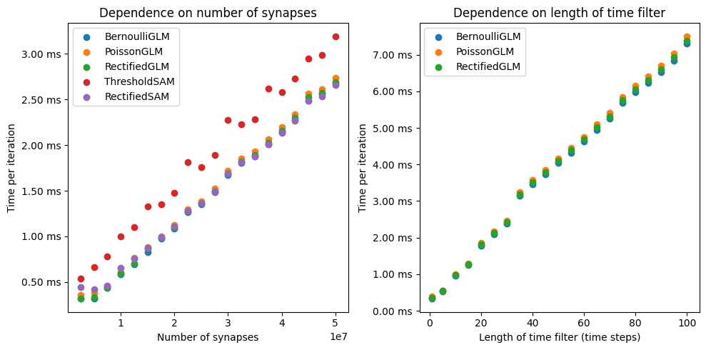
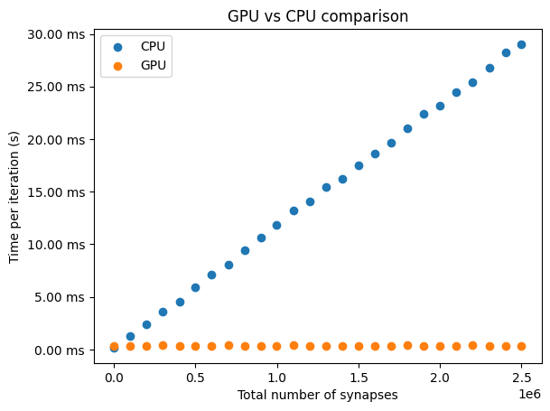
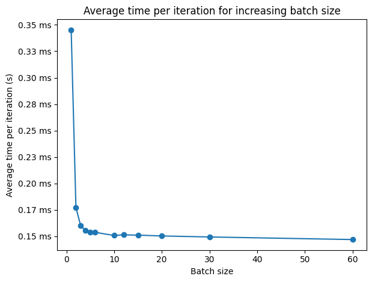

############################
Memory usage and performance
############################

.. currentmodule:: spikeometric.models

In this section, we discuss the memory usage and performance of core spikeometric functionality.
The benchmarks are run in `Google Colab <https://colab.research.google.com/drive/1tQ0ULV04g6W45QCfQheLVFwladLzVJ8v?usp=sharing>`_ and the code is available in the `examples` folder of the
`GitHub repository <https://github.com/bioAI-Oslo/Spikeometric>`_. The GPU used for the experiments in this section is the Nvidia V100 with 16GB of memory
and the CPU is the Intel Xeon with 13GB of RAM.

Memory usage
------------
The main memory consumer when running a simulation is the synaptic weights. The GLM models support time filters on the synaptic weights
to capture persisting effects of the pre-synaptic spikes over time, while the synaptic activation models (:class:`ThresholdSAM` and :class:`RectifiedSAM`)
only consider spike-events from the previous time step. In general, the weights are stored as a :math:`[N_{syn}, T]` tensor, where :math:`N_{syn}` is the number of synapses
and :math:`T` is the length of the time filter. In addition, we need an edge index to specify the pre- and post-synaptic neurons of each synapse, which is stored as a :math:`[2, N_{syn}]` tensor.
One exception is the :class:`BernoulliGLM`, which also includes a refractory period modeled as a negative self-connection, adding
an additional :math:`N_{neurons}` synapses.

We also need to store the number of spikes of each neuron per time step, which by default consumes 32 bytes.
In most cases, however, we don't expect the number of spikes per time step for any neuron to exceed 127, which means we can safely reduce the memory consumption to
8 bytes by passing :code:`torch.int8` as the :code:`store_as_dtype` argument of the :meth:`simulate` method if we need additional memory.

Concretely, the total memory usage (in bytes) of GLM models can be estimated as

.. math::
    M_{GLM} = 32 \cdot T \cdot N_{syn} + 32 \cdot 2 \cdot N_{syn} + 8 \cdot N_{neurons} \cdot N_{steps}

where :math:`N_{syn}` is the number of synapses, :math:`N_{neurons}` is the number of neurons, and :math:`N_{steps}` is the
number. For :class:`BernoulliGLM`, we simply add on another :math:`32 \cdot T \cdot N_{neurons}`. 
In addition to the spikes, the synaptic activation models also need to store a 32 byte floating-point state for each neuron per time step.
The memory usage of the synaptic activation models can therefore be estimated as

.. math::
    M_{SAM} = 32 \cdot T \cdot N_{syn} + 32 \cdot 2 \cdot N_{syn} + 8 \cdot N_{neurons} \cdot N_{steps} + 32 \cdot N_{neurons} \cdot N_{steps}

Performance
-----------
The performance of the Spikeometric models is measured in terms of the time per iteration. Up to ~2 500 000 synapses, 
the time per iteration is roughly constant at ~0.3 ms per iteration for most models, with the :class:`ThresholdSAM` being slightly slower due to
due to the cost of computing its more involved background input. If we run the models for 1000 iterations
for networks with ~2 500 000 synapses up to ~50 000 000 synapses, we can see that the run time eventually increases
approximately linearly with the number of synapses. We also run experiments where we increase
the number of time steps in the time filters up to 100 in steps of 5 for a network of ~2 500 000 synapses. The results are shown in the figure below.

CPU vs GPU
----------

Spikeometric is designed to work well with both CPU and GPU architectures, but utilizing a GPU
brings significant performance benefits when simulating larger networks.
For networks with up to 10 000 synapses, the CPU is faster due to overhead on the GPU, but while time per iteration remains
constant at about 0.3 ms up to about 2 500 000 synapses on the GPU, it increases from 0.15 ms at 1000 synapses to 30 ms per iteration at 2 500 000 synapses on the CPU.

Speed-up from batching
----------------------
The performance of the Spikeometric models can be further improved by batching the simulation of multiple networks. For example, using
the :class:`BernoulliGLM` model, simulating networks with 2 500 000 synapses can be improved to ~0.15 ms per iteration on average 
by batching at least 10 networks at a time. The speed-up from batching is shown in the figure below.

