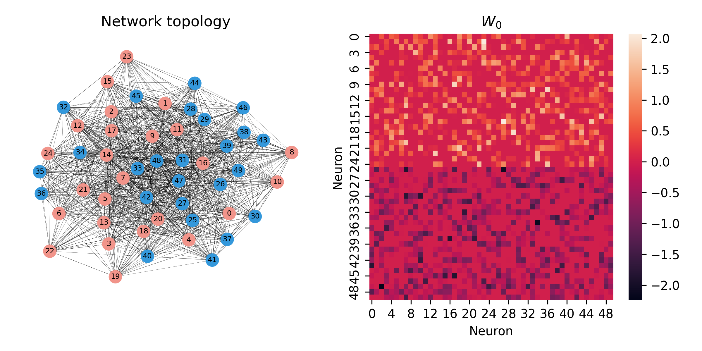
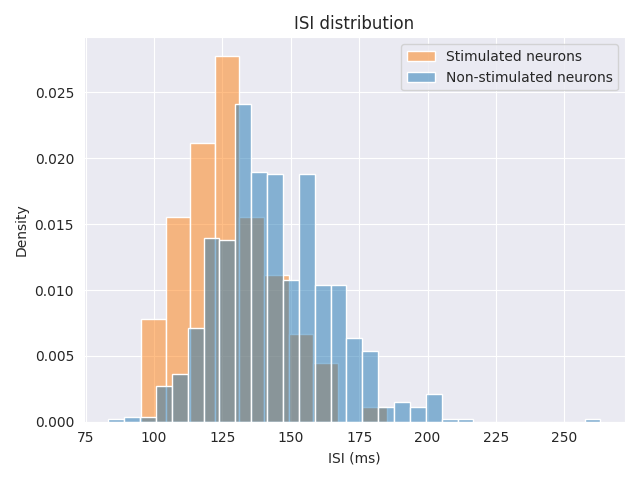
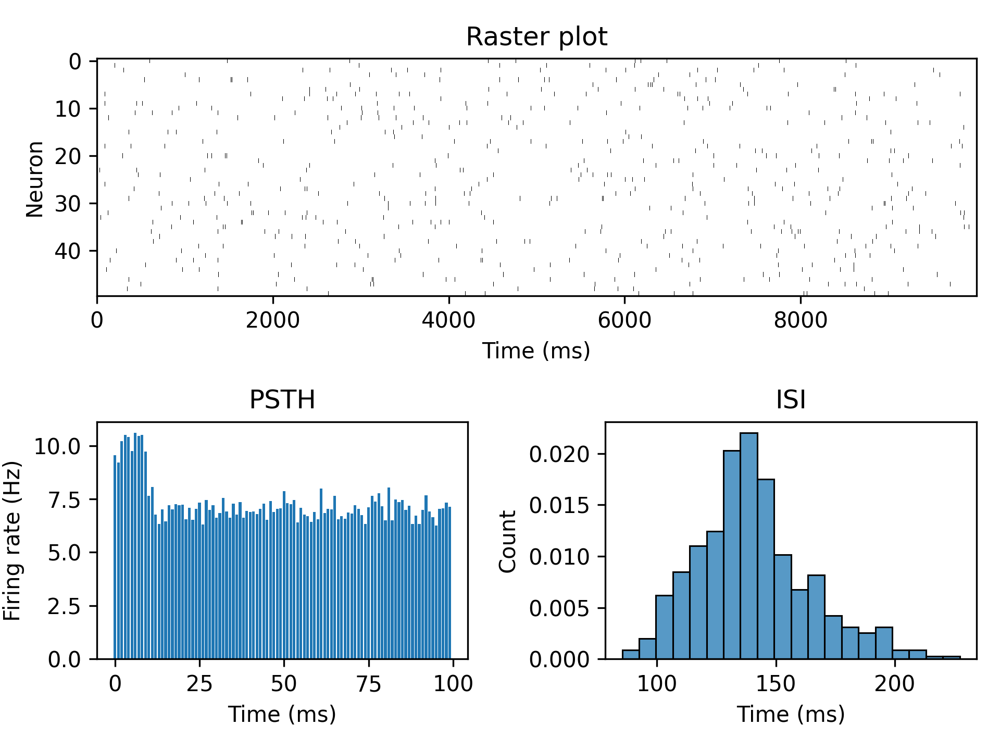

#######################
Introduction by example
#######################

In this section we will introduce the basic concepts of the package.
We'll start by briefly explaining how Generalized Linear Models (GLM) and 
Linear-Nonlinear-Poisson (LNP) models are used to simulate neural data. 
We will then introduce the main functions of the package through an example where they are
put together to simulate neural data.

GLM and LNP: Stochastic models of neural networks
==================================================
The `GLM <https://en.wikipedia.org/wiki/Generalized_linear_model>`_ and `LNP <https://en.wikipedia.org/wiki/Linear-nonlinear-Poisson_cascade_model>`_
models are stochastic models of biological neural networks that are used to simulate neural data.
They do not attempt to model the subcellular mechanisms that underlie neural activity, but rather to model the statistical properties
of the network. Instead of currents and voltages, they model probabilities or expected spike counts and 
use these to emit spikes from the network. While they are not biologically realistic on a neuron level, they are very useful
for when studying the network as a whole, and has the extra benefit that the parameters of the model can be fitted to real neural data 
using maximal likelihood estimation. The GLM and LNP models are closely related. In fact, the GLM is a special case of the LNP model where the non-linearity
is invertible.

Introductory example
====================

.. currentmodule:: spikeometric.models

.. note::
    This example is available as a Jupyter notebook in the ``examples`` directory of the package.

A very common usecase for GLM and LNP models is as stimulus-response models where we stimulate the network with some external input 
and analyze the results.

A typical workflow for stimulus-response experiments is as follows:
    #. Generate or load a set of connectivity matrices.
    #. Define a model and a stimulus.
    #. Run the model on the connectivity dataset
    #. Analyze the results.

In this example we will generate some random connectivity matrices and use the :class:`BernoulliGLM` model with :class:`RegularStimulus`
to simulate 100 seconds of network activity. We will then analyze the results by comparing the
interspike intervals (ISI) of the stimulated and unstimulated neurons. Finally, we will make some plots to
show how the network's activity changes over the stimulus period.

Generating and loading connectivity datasets
--------------------------------------------
.. currentmodule:: spikeometric.datasets

We will start by showing how to generate and load connectivity datasets. Often, we will already have a set of connectivity
matrices that we want to use in our experiments, in which case we can use the :class:`ConnectivityDataset` class to load them directly.
However, in this example we will generate some random connectivity matrices using the :class:`NormalGenerator` class, to show how it works.

We will generate 10 random networks with 50 neurons each. There will be an equal number of excitatory and inhibitory neurons, with 
a total of :math:`50^2/2` synaptic weights drawn from a normal distribution with mean 0 and standard deviation :math:`5 / \sqrt{50}` (glorot initialization). 

The networks are saved to the ``data/w0/50_neurons_10_0_mean_5_std_glorot`` directory as individual `.pt` files. Note that the
:class:`ConnectivityDataset` class can also load `.npy` files, so if you prefer to save your connectivity matrices with :mod:`numpy`, you can do that instead.

.. code-block:: python

    generator = NormalGenerator(
        n_nodes=50,
        mean=0,
        std=5,
        glorot=True
    )
    generator.save(10, "data/w0/100_neurons_10_networks_0_mean_5_std_glorot")

The dataset is now saved, and we can load it using the :class:`ConnectivityDataset` class.

.. code-block:: python

    dataset = ConnectivityDataset("data/w0/50_neurons_10_networks_0_mean_5_std_glorot_14071789")

To understand what the networks look like, we can draw the graphs and plot the weight matrices using :mod:`networkx` and :mod:`seaborn`.

Initializing the model
----------------------
.. currentmodule:: spikeometric.models

The next step is to define the model that we want to use. We will use the Bernoulli GLM model, which is implemented
in the :class:`BernoulliGLM` class, using the same parameters as in the original paper 
`"Inferring causal connectivity from pairwise recordings and optogenetics" <https://www.biorxiv.org/content/10.1101/463760v3.full>`_.

.. code-block:: python

    model = BernoulliGLM(
        alpha= 0.2,               # Decay rate of the coupling strength between neurons (1/ms)
        beta= 0.5,                # Decay rate of the self-inhibition during the relative refractory period (1/ms)
        abs_ref_scale=3,          # Absolute refractory period in time steps
        rel_ref_scale=7,          # Relative refractory period in time steps
        abs_ref_strength=-100,    # Strength of the self-inhibition during the absolute refractory period
        rel_ref_strength=-30,     # Initial strength of the self-inhibition during the relative refractory period
        coupling_window=5,        # Length of coupling window in time steps
        theta=5,                  # Threshold for firing
        dt=1,                     # Length of time step (ms)
    )

Adding a stimulus
-----------------
.. currentmodule:: spikeometric.stimulus

Now, we also want to add a stimulus. For that we need two things:

    #. A callable object that takes one argument (the time step) and returns the stimulus at that time 
    #. For each network in the dataset, a boolean mask that defines which neurons are targeted by the stimulus.

We'll use the :class:`RegularStimulus` class to stimulate the network once every second, for 100 ms each time.
The strength of the stimulus is set to 5.0, which given the threshold parameter :code:`theta = 5` of the GLM model, 
will result in a ~50% chance of firing for a neuron at rest. 

For each network, we will stimulate 4 random excitatory neurons. 

.. code-block:: python

    stimulus = RegularStimulus(
        strength=5.0,
        interval=100,
        duration=100_000,
        tau=10,
        dt=1,
    )
    model.add_stimulus(stimulus)

    stimulus_masks = [torch.isin(torch.arange(n_neurons), torch.randperm(n_neurons//2)[:4]) for _ in range(10)]
    dataset.add_stimulus_masks(stimulus_masks)

Running the model
-----------------
.. currentmodule:: spikeometric.models.bernoulli_glm

We are now ready to run the model on the connectivity dataset.
We will use a :class:`torch_geometric.loader.DataLoader` to load the connectivity matrices in batches of 5.
The data loader combines the connectivity data from each bach into a larger graph with each individual network as an isolated subgraph.
The :meth:`simulate` method of the model then simulates the network activity for the specified number of time steps.

.. code-block:: python
    
    loader = DataLoader(
        dataset,
        batch_size=5,
        shuffle=False,
    )

    results = torch.zeros((500, 100_000)) # 50x10 neurons and 100_000 time steps
    for i, batch in enumerate(loader):
        results[i*batch.num_nodes:(i+1)*batch.num_nodes] = model.simulate(batch, n_steps=100_000)

The spike trains are now stored in the ``results`` tensor with shape ``(500, 100_000)``. Each row corresponds to a neuron, 
and each column to a time step, with a value of 1 indicating a spike and 0 indicating no spike.

Let's now compare the stimulated and unstimulated neurons by plotting their ISI distributions

We see that the stimulated neurons have a lower ISI. This is as expected, as the stimulus increases the firing rate, which is inversely
proportional to the ISI.

Plotting the results
--------------------
To round off the example, we will plot the collective ISI histogram, a Peri-Stimulus Time Histogram (PSTH) and a raster plot of the spike trains for the first network.

That is it for the introductory example! The package is designed to be as easy to use as possible, and we hope that it will be
useful for researchers in the field of computational neuroscience. For more examples of how to use the package, see
the `Tutorials` section, or take a look at the `notebooks in the examples directory of the repository <https://github.com/bioAI-Oslo/spikeometric>`_ 
(this example is taken from the ``examples/simulate_with_stimulus.ipynb`` notebook).
