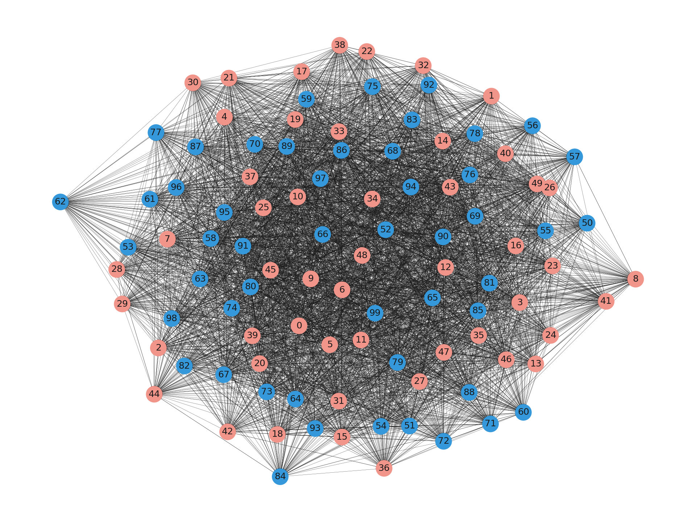
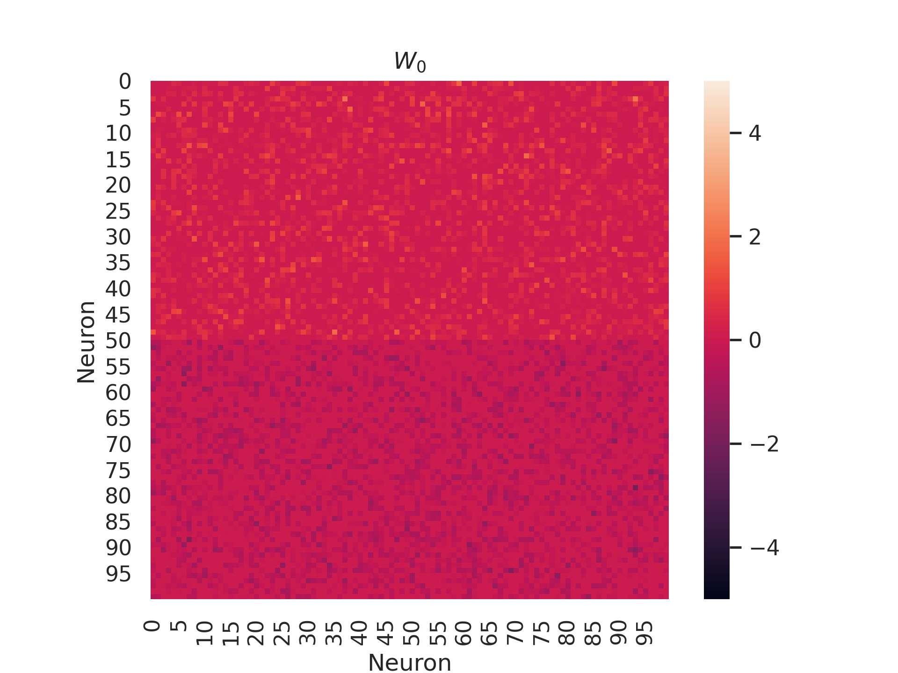
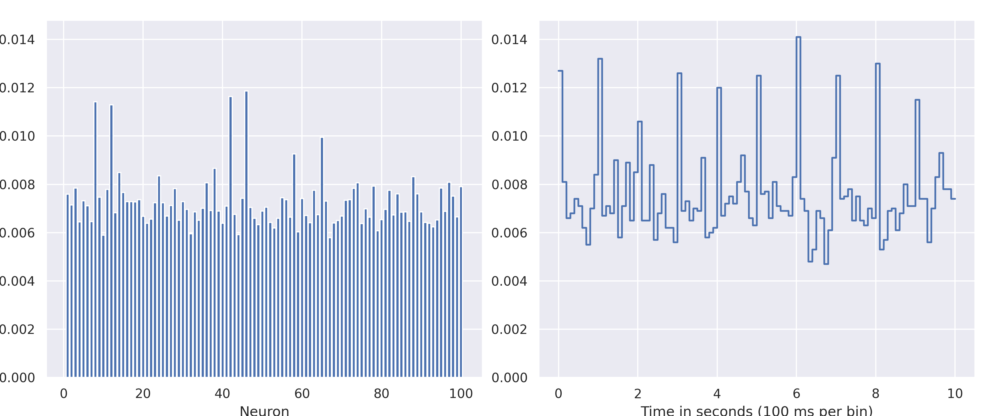

####################
Introduction
####################

In this section we will introduce the basic concepts of the package.
We'll start by briefly explaining how Generalized Linear Models (GLM) and 
Linear-Nonlinear-Poisson (LNP) models are used to simulate neural data. 
We will then introduce the main functions of the package one by one, and show by example how they are
put together to simulate neural data.

GLM and LNP: Stochastic models of neural networks
==================================================
The `GLM <https://en.wikipedia.org/wiki/Generalized_linear_model>`_ and `LNP <https://en.wikipedia.org/wiki/Linear-nonlinear-Poisson_cascade_model>`_
models are stochastic models of biological neural networks that are used to simulate neural data.
They do not attempt to model the subcellular mechanisms that underlie neural activity, but rather to model the statistical properties
of the network. Instead of currents and voltages, they model probabilities or expected spike counts and 
use these to emit spikes from the network. While they are not biologically realistic on a neuron level, they are very useful
for when studying the network as a whole, and has the extra benefit that the parameters of the model can be fitted to real neural data 
using maximal likelihood estimation. The GLM and LNP models are closely related. In fact, the GLM is a special case of the LNP model where the non-linearity
is invertible (cit).

Now that we have introduced the GLM and LNP models, we will explain how they are implemented in the package.

Models
======
The GLM and LNP models are implemented as classes that inherit from the :class:`MessagePassing` class from the `PyTorch Geometric <https://pytorch-geometric.readthedocs.io/en/latest/>`_ library.
We represent the network as a graph, where each node corresponds to a neuron and each edge corresponds to a synapse.
The nodes are connected according to a weight matrix :math:`\mathbf{W_0}`, where the element :math:`W_{ij}` is the weight of the synapse between neuron :math:`i` and neuron :math:`j`.
The state of the network at time step :math:`t` is represented by a vector :math:`\mathbf{X}_t` where each element corresponds to the spike count of a neuron at time step :math:`t`.

While there are many different types of GLM and LNP models, they all share a common structure. 
For each neuron :math:`i`, the state at time step :math:`t+1` is computed in three steps:

#. The input stage
    The first step is to compute the synaptic input :math:`g_i(t+1)` to neuron :math:`i` at time step :math:`t+1`.
    Input can come from several sources.
    
    * If a neuron :math:`j` that is connected to :math:`i` has recently fired, :math:`i` will receive some input as a function of the synaptic weight :math:`W_{ji}` between the two neurons and how long it has been since :math:`j` fired.

    * If :math:`i` itself has recently fired, it will be in a refractory period and will receive some self-inhibiting input.

    * There might also be some background input that is independent of the network state.

    * Finally, :math:`i` may receive an external input, for example from an optogenetic stimulus.

#. The non-linear stage
    The second step is to compute the response of the neuron to the synaptic input by 
    applying a non-linear function to it.
    In the GLM, the non-linearity is the inverse link function, for example the inverse logit function (sigmoid) for the 
    Bernoulli model. In the LNP, the non-linearity might for example be the rectified linear unit (ReLU) function. 
    The output of this step is often interpreted as the expected spike count of the neuron.

#. The spike emission stage
    The final step is to draw a spike count from a probability distribution that depends on the output of the non-linear stage.
    The probability distribution is often a Poisson distribution, but it can also be a Bernoulli distribution for the GLM.

These three steps form the core of the GLM and LNP models, and each class must implement them in the
:func:`input`, :func:`non_linearity` and :func:`emit_spikes` functions, respectively.

Connectivity datasets and stimulation
=====================================
In addition to the models, there are two other key components of the package: the connectivity datasets and the
stimulation models. 

Connectivity datasets
----------------------
The connectivity datasets are collections of graphs that represent the connectivity of a set of networks.

There are two ways to work with the connectivity datasets. The first is to use the :class:`ConnectivityDataset` class,
which is a wrapper around a PyTorch Geometric dataset. This class allows us to easily load weight matrices from a
directory that contains a set of torch or numpy files, and to convert them to a PyTorch Geometric dataset. This is 
useful if we have some predesigned connectivity matrices that we want to use in our experiments.

The second way to work with the connectivity datasets is to use one of the :class:`ConnectivityDatasetGenerator` classes
that are provided in the package. These classes can be used to generate random connectivity matrices from a couple common
distributions, save them to disk and load them into a PyTorch Geometric dataset. It is also possible to generate them
on the fly, without saving them, by using the :func:`generate_examples` method. This is useful if we want to generate
some example connectivity matrices to use in our experiments.

Stimulation
------------
The stimlation classes are used to define the external input to the network. They inherit from the :class:`Module` class 
from torch, which opens the door to tuning the parameters of the stimulation parameters as well. A couple of stimulation models are provided in the package, but it is easy to implement
new ones by inheriting from the :class:`Stimulation` class. For an example of how to do this, see :doc:`Create stimulus <../tutorials/create_stimulus>`.

Connectivity loader
-------------------
The :class:`ConnectivityLoader` class is used to load the connectivity matrices from a dataset in batches
and, together with the targets for the stimulation, if they are provided. It groups the connectivity matrices in
each batch into one large graph, allowing us to simulate the networks in parallel.
It is used in the same way as the :class:`DataLoader` class from PyTorch Geometric, in fact it is a wrapper around it.

Example usage
=============
The following example shows how to use the package to generate a connectivity dataset and simulate the networks with
a regular stimulus.

We first want to generate a connectivity dataset with 10 networks, each with 100 neurons, and save it to disk.
The networks should have a synaptic weights that are drawn from a normal distribution with mean 0 and standard
deviation :math:`5 / \sqrt{100}` (glorot initialization). We will save the dataset to the ``data/w0/100_neurons_10_0_mean_5_std_glorot_14071789`` directory for later
use. 

.. code-block:: python

    from spiking_network.datasets import NormalConnectivityGenerator

    generator = NormalConnectivityGenerator(
        n_nodes=100,
        n_networks=10,
        mean=0,
        std=5
        glorot=True
        rng = torch.Generator().manual_seed(14071789)
    )
    generator.save("data/w0/100_neurons_10_0_mean_5_std_glorot_14071789")

The dataset is now saved to disk, and we can load it into a PyTorch Geometric dataset using the :class:`ConnectivityDataset` class.

.. code-block:: python

    from spiking_network.datasets import ConnectivityDataset

    dataset = ConnectivityDataset("data/w0/100_neurons_10_0_mean_5_std_glorot_14071789")

To understand what the networks look like, we can draw the graphs and plot the weight matrices.

.. code-block:: python

    import seaborn as sns
    import networkx as nx
    from torch_geometric.utils import to_networkx, to_dense_adj

    fig, axs = plt.subplots(2, 1, figsize=(15, 6))

    example_data = dataset[0]
    G = to_networkx(example_network, remove_self_loops=True)
    color_map = ["#f1948a" for _ in range(n_neurons//2)] + ["#3498db" for _ in range(n_neurons//2, n_neurons)] # Red for excitatory, blue for inhibitory

    # Visualize the network
    nx.draw(G, node_size=100, node_color=color_map, width=0.1, arrowsize=1, with_labels=True, font_size=6, ax=axs[0])

    # Visualize the weight matrix
    dense_W0 = to_dense_adj(example_data.edge_index, edge_attr=example_data.W0, max_num_nodes=example_data.num_nodes)[0]
    sns.heatmap(square_W0, square=True, vmin=-5, vmax=5)
    plt.title(r"$W_0$")
    plt.xlabel("Neuron")
    plt.ylabel("Neuron")
    plt.show()

The next step is to define the model that we want to use. We will use the Bernoulli GLM model, which is implemented
in the :class:`BernoulliGLM` class, using the same parameters as in the original paper 
`"Inferring causal connectivity from pairwise recordings and optogenetics" <https://www.biorxiv.org/content/10.1101/463760v3.full>`_.

.. code-block:: python

    from torch_geometric.nn import BernoulliGLM

    model = BernoulliGLM(
        alpha=0.2,
        beta=0.5,
        abs_ref_scale=3,
        abs_ref_strength=-100,
        rel_ref_scale=7,
        rel_ref_strength=-30,
        S=5
        T=10,
        theta=5.,
        dt=1,
    )

Now, we also want to add a stimulation. For this example we use the :class:`RegularStimulation` class, which will stimulate
the network once every second, for 100 ms each time. The strength of the
stimulation is set to 5.0, which given the threshold parameter :math:`\theta = 5` of the GLM model, will result in a ~50% chance of firing for a neuron at rest.
For each network, we will stimulate 4 random neurons.

.. code-block:: python

    from torch_geometric.nn import PoissonStimulation

    targets = [torch.randint(0, 100, (4,)) for _ in range(10)]
    stimulation = PoissonStimulation(
        strength=5.0,
        interval=1000,
        duration=100,
        dt=1,
    )
    model.add_stimulation(stimulation)

Finally we can use the :class:`ConnectivityLoader` class to load the connectivity matrices from the dataset in batches, 5 at a time,
and simulate the networks in parallel as one large graph.

.. code-block:: python

    from torch_geometric.nn import ConnectivityLoader

    loader = ConnectivityLoader(
        dataset,
        batch_size=5,
        shuffle=False,
        targets=targets
    )

    results = []
    for i, batch in enumerate(loader):
        results.append(
            model.simulate(batch, n_steps=100_000, stimlation=stimulation
        )
    X = torch.cat(results, dim=0)

The results are now stored in the ``X`` tensor, and can be used for further analysis.
For example, we can plot the firing rates of the neurons in the first network.

.. code-block:: python

    X = X[:n_neurons].float()

    fig, axes = plt.subplots(nrows=1, ncols=2, figsize=(5, 3))

    fig.set_figheight(10)
    fig.set_figwidth(12)
    axes[0].set_title("Firing rate per neuron")
    axes[0].set_ylabel("Firings")
    axes[0].set_xlabel("Neuron")
    axes[0].bar(range(1, n_neurons + 1), torch.mean(X, axis=1))

    time_slice = 10000 # For a nicer plot, we only look at the first 10 seconds
    X_sliced = X[:, :time_slice]
    len_of_bin = 100 # We bin the time steps to get a smoother plot
    n_bins = time_slice // len_of_bin
    axes[1].set_title("Firings per timestep")
    axes[1].set_ylabel("Firings")
    axes[1].set_xlabel(f"Time in seconds ({len_of_bin} ms per bin)")

    firings_per_bin = X_sliced.mean(axis=0).view(n_bins, -1).mean(axis=1).repeat_interleave(len_of_bin)
    axes[1].plot(
    torch.arange(1, time_slice + 1) / (1000/model.dt),
    firings_per_bin,
    )

    plt.show()

We can clearly see the the effect of the stimulation as the firing rate of the network as a whole is much higher in the period where the stimulation is active.

That is all there is to it! The package is designed to be as easy to use as possible, and we hope that it will be
useful for researchers in the field of computational neuroscience. For more examples of how to use the package, see
the `Tutorials` section, or take a look at the `notebooks in the examples directory of the repository <https://github.com/bioAI-Oslo/snn-glm-simulator>`_ 
(this example is taken from the ``examples/bernoulli_glm_example.ipynb`` notebook).

References
==========
Integrate and fire
