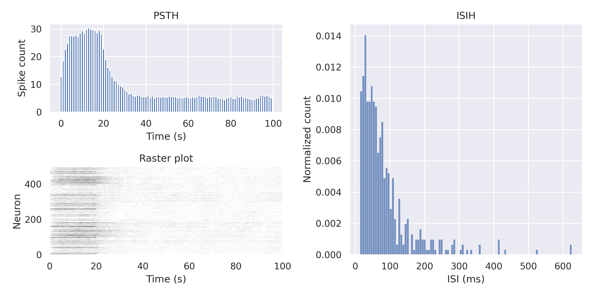

Implementing a new model
========================

.. currentmodule:: spikeometricdels

If you want to use simulate using a model that is not already implemented in the package, you can define your own by subclassing the :py:class:`BaseModel`
and implementing the `input`, `nonlinearity` and `emit_spikes` methods. If you also want to include a time filter on the weights, you can do so by providing an
implementation of the `connectivity_filter`. 

In this example, we will implement model that has a refractory period like the one you find in the :py:class:`BernoulliGLM` model,
uses the rectifier non-linearity like :py:class:`RectifiedLNP` and has a multidimensional stimulus filter.

In short we want to compute spikes by the following sequence of equations:

    #. :math:`g_i(t+1) = \sum_{j \in \mathcal{N}(i)\cup \{i\}} \mathbf{W}_{j, i} \cdot \mathbf{x}_j + \mathbf{k}\cdot \mathbf{f_i}(t+1)`
    #. :math:`\mu_i(t+1) = \lambda_0[g_i(t+1) - \theta]_+`
    #. :math:`x_i(t+1) = \text{Pois}(\mu_i(t+1))`
 
In step 1, :math:`\mathbf{W}_{j, i}` holds the synaptic weights between neuron :math:`j` and :math:`i` over a fixed number of time steps :math:`T` 
(including self-edges that are self-inhibitory for the refractory periods), :math:`\mathbf{x}_j` is the spike history of :math:`j` over 
the past :math:`T` time steps, :math:`\mathbf{k}` is the stimulus filter and :math:`\mathbf{f}_i(t+1)` is the stimulus to :math:`i` at time step 
:math:`t+1`.
In step 2, :math:`\lambda_0` scales the expected spike rate and :math:`\theta` is the threshold input needed for the neurons to have non-zero expected firing rate.
In step 3, :math:`\text{Pois}` is the Poission distribution.

Implementation
-----------------

.. currentmodule:: spikeometricdels.BaseModel

We will describe the implementation process in a step by step fashion, first making the constructor, 
followed by the :py:meth:`connectivity_filter` and :py:meth:`stimulus_filter` methods before we finish 
off with the three essential :py:meth:`input`, :py:meth:`non_linearity` and :py:meth:`emit_spikes` methods.

Constructor
-----------------
Let's start by making a constructor that sets our arguments as parameters or buffers according to whether we want the them to be tunable or not.

We need a few arguments:
    #. :math:`\lambda_0`, the scaling of the expected spike rate (tunable)
    #. :math:`\theta`, the threshold input (tunable)
    #. :math:`\Delta t`, the length of the time step in milliseconds
    #. :math:`T`, the number of time steps we want to consider back in time
    #. :math:`r`, a function that determines the refractory time course
    #. :math:`w`, a function that determines the time course of the synaptic weights
    #. :math:`k`, a function that determines the stimulus filter

Note that, while using functions to specify the filters is convenient, 
they will not be part of the model's state dict and so can't be saved and loaded like tensors can. They also can't be tuned.

.. code-block:: python

    def __init__(self, lambda_0: float, theta: float, dt: float, T: int, r: callable, w: callable, k: callable, rng=None):
        super(self).__init__()
        # Buffers
        T = T / dt # Convert to number of time steps
        self.register_buffer("T", torch.tensor(T, dtype=torch.int))
        self.register_buffer("dt", torch.tensor(dt, dtype=torch.float32))

        # Parameters
        self.register_parameter("lambda_0", torch.nn.Parameter(torch.tensor(lambda_0, dtype=torch.float32)))
        self.register_parameter("theta", torch.nn.Parameter(torch.tensor(theta, dtype=torch.float32)))

        # Functions
        self.r = r
        self.w = w
        self.k = k

        # RNG
        self._rng = rng if rng is not None else torch.Generator()

        self.requires_grad_(False) # This is set so that the model does not compute gradients by default.

The buffers are used to store attributes that we want to be part of the state dict but which are not tunable. 
The parameters *are* tunable, but since we don't want to compute gradients when we are simulating (this takes a lot of memory and time),
gradients are turned off by default with :code:`self.requires_grad_(False)`.

Connectivity filter
-------------------
The :py:meth:`connectivity_filter` method lets us expand the synaptic weights to include a time dimension.
It should take two arguments, the weights `W0` and the `edge_index` and should return a connectivity filter tensor `W` of dimension `[n_edges, T]` 
where the element `W[i, t]` tells us how much a spike at time step `t-T` before the present should be weighted. 

In our model there will be two types of edges: the coupling edges and the refractory edges. 
The coupling edges hold the strength and time evolution of synaptic connections and the refractory edges determines 
the self-inhibition during the refractory period.

Based on the `edge_index` we split the edges into coupling and refractory and make 
use of the :py:func:`r` and :py:func:`w` functions we pass to the model to compute the time course of the refractory and coupling edges. 
They are flipped to get the weights associated with the last time step in the last column.

.. code-block:: python

    def connectivity_filter(self, W0: torch.Tensor, edge_index: torch.Tensor) -> torch.Tensor:
        i, j = edge_index # Split the edge index in source and target neurons
        is_self_edge = i == j # Boolean mask of self-edges

        # Time steps going back T time steps
        t = torch.arange(self.T)

        refractory_edges = self.r(t).repeat(is_self_edge.sum(), 1)   # Refractory edges [n_self_edges, T]
        coupling_edges = W0[~is_self_edge].unsqueeze(1) * self.w(t)  # Coupling edges [n_edges - n_self_edges, T]

        W = torch.zeros((W0.shape[0], self.T))
        W[is_self_edge] = refractory_edges
        W[~is_self_edge] = coupling_edges

        return W.flip(1)

Stimulus filter
----------------
We want the model to handle a multidimensional stimulus given to some of the neurons, 
and must implement a :py:meth:`stimulus_filter` method to determine how this stimulus will be integrated into an input. 
The function :py:func:`k` that we pass to the model will help us with this. 
Note that we are assuming that all targeted neurons receive the same stimulus and that they have the same stimulus filter.

.. code-block:: python

    def stimulus_filter(self, stimulus: torch.Tensor) -> torch.Tensor:
        return torch.sum(stimulus*self.k(torch.arange(stimulus.shape[0])))

Input
------
The neurons will receive synaptic input and stimulus input. Both the :py:meth:`synaptic_input` and the :py:meth:`stimulus_input` 
methods are already implemented in the :py:class:`BaseModel`. All we need is to call them.

.. code-block:: python

    def input(self, edge_index: torch.Tensor, W: torch.Tensor, state: torch.Tensor, t=-1, stimulus_mask: torch.Tensor = False) -> torch.Tensor:
        return self.synaptic_input(spikes, edge_index, W) + self.stimulus_input(t, stimulus_mask)

Non-linearity
--------------
After we have collected the input to the neurons, we need to apply a non-linearity to it. In this case, 
we use a rectified linear non-linearity. The rate is scaled by the time step to ensure that increasing the resolution
of the simulation doesn't artificially increase the firing rate.

.. code-block:: python

    def non_linearity(self, input: torch.Tensor) -> torch.Tensor:
        return self.lambda_0*torch.relu(input - self.theta) * self.dt

Emitting spikes
----------------
Finally, we need to decide which neurons will emit spikes. This is done by interpreting the output of the non-linearity 
as the expected number of spikes in that time step. We then sample from a Poisson distribution with this mean to determine
which neurons will spike.

.. code-block:: python

    def emit_spikes(self, input: torch.Tensor) -> torch.Tensor:
        return torch.poisson(input, generator=self._rng)

This is all we need to implement to get a working model. We can now instantiate it and simulate it.

Summary
--------
.. code-block:: python

    class FilRectLNP(BaseModel):
        def __init__(self, lambda_0: float, theta: float, dt: float, T: int, r: callable, w: callable, k: callable, rng=None):
            super().__init__()
            # Buffers
            T = T / dt
            self.register_buffer("T", torch.tensor(T, dtype=torch.int))
            self.register_buffer("dt", torch.tensor(dt, dtype=torch.float32))

            # Parameters
            self.register_parameter("lambda_0", torch.nn.Parameter(torch.tensor(lambda_0, dtype=torch.float32)))
            self.register_parameter("theta", torch.nn.Parameter(torch.tensor(theta, dtype=torch.float32)))

            # Functions
            self.r = r
            self.epsilon = w
            self.k = k

            # RNG
            self._rng = rng if rng is not None else torch.Generator()

            self.requires_grad_(False) # This is set so that the model does not compute gradients by default.

        def connectivity_filter(self, W0: torch.Tensor, edge_index: torch.Tensor) -> torch.Tensor:
            i, j = edge_index # Split the edge index in source and target neurons
            is_self_edge = i == j # Boolean mask of self-edges

            # Time steps going back T time steps
            t = torch.arange(self.T)

            refractory_edges = self.r(t).repeat(is_self_edge.sum(), 1) # Refractory edges [n_self_edges, T]
            coupling_edges = W0[~is_self_edge].unsqueeze(1) * self.w(t)         # Coupling edges [n_edges - n_self_edges, T]

            W = torch.zeros((W0.shape[0], self.T))
            W[is_self_edge] = refractory_edges
            W[~is_self_edge] = coupling_edges

            return W.flip(1)

        def stimulus_filter(self, stimulus: torch.Tensor) -> torch.Tensor:
            return torch.sum(stimulus*self.k(torch.arange(stimulus.shape[0])))
        
        def input(self, edge_index: torch.Tensor, W: torch.Tensor, state: torch.Tensor, t=-1, stimulus_mask: torch.Tensor = False) -> torch.Tensor:
            return self.synaptic_input(edge_index, W, state) + self.stimulus_input(t, stimulus_mask)

        def non_linearity(self, input: torch.Tensor) -> torch.Tensor:
            return self.lambda_0*torch.relu(input - self.theta) * self.dt
        
        def emit_spikes(self, rates: torch.Tensor) -> torch.Tensor:
            return torch.poisson(rates, generator=self._rng)

Testing the model
------------------
To test the model, we will simulate some networks with 50 neurons. We will use a random connectivity matrix  with normal weights and a periodic random stimulus.

.. code-block::

    n_neurons = 50
    test_data = NormalGenerator(n_neurons, mean=0, std=0.1, glorot=True).generate(10)
    loader = DataLoader(test_data, batch_size=5, shuffle=False)

    def r(t):
        return -100.*(t < 2) + -100*torch.exp(-2*(t-2))*(t >= 2)*(t<5)

    def w(t):
        return torch.exp(-t/2)

    def k(f):
        return torch.exp(-f/5) # weight lower frequencies more

    def stimulus(t):
        return 0.1*torch.rand(5) * (t % 100 < 20)

    model = FilRectLNP(lambda_0=1, theta=-0.01, dt=1, T=20, r=r, w=w, k=k)

Since we don't know what parameters to use, we'll make a guess and then tune them to give a firing rate of 10 Hz.
We'll use a learning rate of 1e-4 and train for 100 epochs with 500 time steps per epoch. Note that 
the model is not trained to fit a set of spike trains, but rather to give a firing rate of 10 Hz. 
Note also that we might need to try a few different inital parameters to get something that doesn't blow up.

.. code-block::

    for data in loader:
        model.tune(data, firing_rate=10, lr=1e-4, n_epochs=100, n_steps=500)

When the tuning is done, we can check what parameters the model has converged to.
In this case, we find that `lambda_0=0.9882` and `theta=-0.0018`.

We can now simulate the model on the data.

.. code-block::

    results = torch.zeros((len(test_data), n_neurons))
    for i, data in enumerate(loader):
        results[i*data.num_nodes:(i+1)*data.num_nodes] = model.simulate(data, n_steps=500)

And plot the results we get the following PSTH, ISI and raster plot

That's it! We have now implemented a brand new model that can be used to simulate networks of spiking neurons.
For more information on how to use the model, take a look at the other tutorials or check out the example notebooks
in the `examples` folder (this tutorial is also available as a notebook).