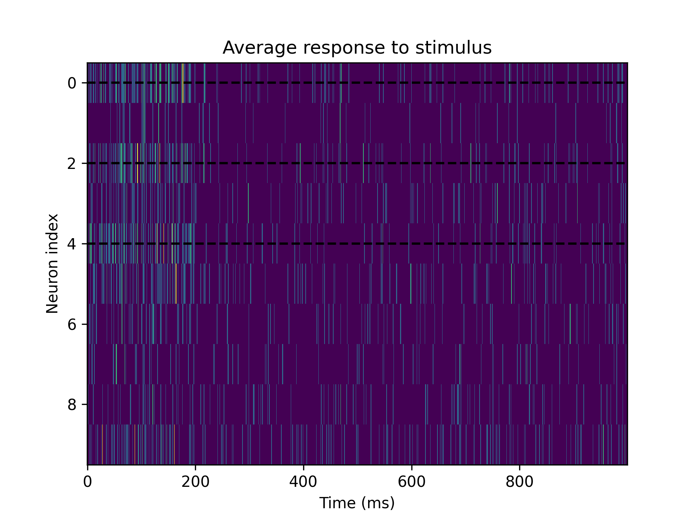
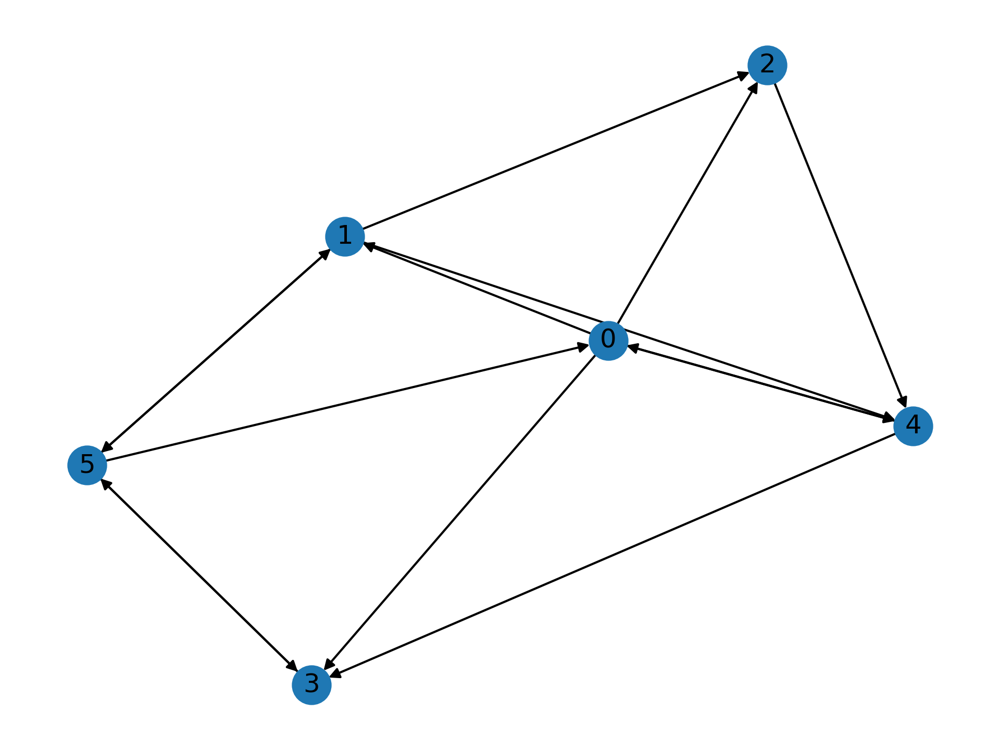
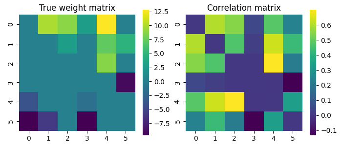
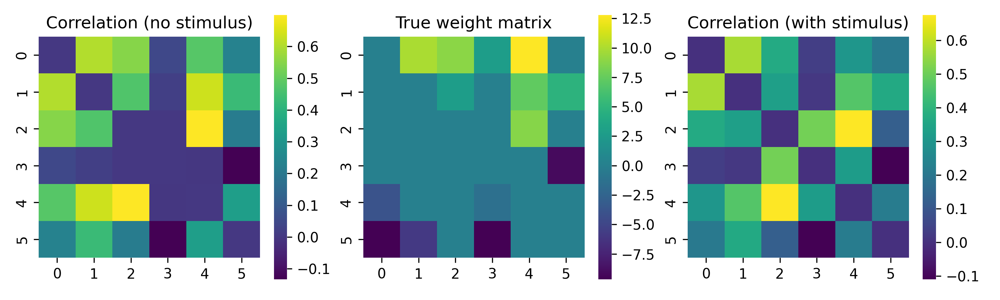
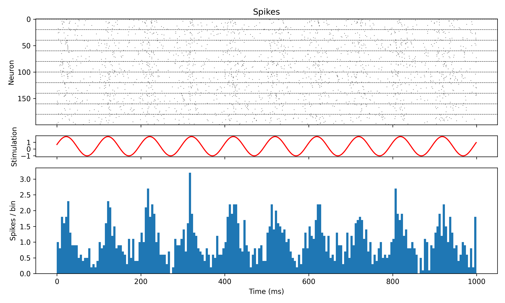

Working with stimuli
====================

.. currentmodule:: spikeometric.stimulus

In this example we will show how to work with stimuli, an essential part of the modelling workflow.

To stimulate a network with an external input we need two things:
    #.  A callable that is added to the model by passing it to the `add_stimulus` method
    #.  A stimulus mask of length `n_neurons` that tells us which neurons are targeted.

The callable can be user-defined function or one of the stimulus modules provided by the package. These modules extend :py:class:`torch.nn.Module`
and can be conveniently tuned using the model's :meth:`tune` method.

We'll start by showing how to pass a custom pre-defined stimulus function. 
Secondly, we'll use the :py:class:`PoissonStimulus` to simulate the presence of an external neuron that projects to a some of the neurons in the network.
We'll end by using tuning to synchronize the actvity of a network with the frequency of a sinusoidal stimulus.

Passing a custom stimulus function
----------------------------------
Sometimes there is no need to tune the stimulus and we simply want to stimulate some neurons with a stimulus that depends on 
time in a straight forward, pre-defined way. One such example could be a regular stimulus with a fixed period. Let's see how to do that.

First, we define a custom stimulus function that takes the current time as an argument and returns a stimulus scalar value. In this example we'll use a 
periodic stimulus of period 1000 ms, that stimulates the targeted neurons with a strength 2. for the first 200 ms of each period.

.. code-block:: python

    data = NormalGenerator(10, mean=0, std=3).generate(1, add_self_loops=True)[0]    # 1 example, 10 neurons
    model = BernoulliGLM(
        theta=5,
        dt=1.,
        coupling_window=20,
        abs_ref_scale=2,
        abs_ref_strength=-100,
        rel_ref_scale=7,
        rel_ref_strength=-30,    
        alpha=0.2,
        beta=0.5,
    )
    model.add_stimulus(lambda t: 2*(t % 1000 < 200))

    # Let's stimulate neuron 0, 2, and 4
    stim_mask = torch.isin(torch.arange(10), torch.tensor([0, 2, 4])) # Boolean mask [10]
    data.stimulus_mask = stim_mask

    # Define the dataset
    spikes = model.simulate(data, n_steps=10000)

After we've defined the model and the stimulus, we can simulate the network and plot the results. 
Since the stimulus is periodic we treat each 1000 ms as a separate trial and plot the average activity of the neurons
at each time step in the period. 

Adding a confounding stimulus
-----------------------------

In this example we'll use the :py:class:`PoissonStimulus` to simulate the presence of an external neuron 
that projects to a pair of unconnected neurons in the network and see how it affects the cross-correlation, a measure of neural connectivity.

We'll use a small network of only 6 neurons to easily spot the unconnected neurons from a graph plot of the network.

.. code-block:: python

    n_neurons = 6
    n_steps = 100000
    network = NormalGenerator(n_neurons, mean=0, std=3, rng=torch.Generator().manual_seed(532)).generate(1, add_self_loops=True)[0]

    G = to_networx(network, remove_self_loops=True)
    nx.draw(G, with_labels=True)

We can see that neuron 2 and 3 are not directly connected, so we'll make them the target neurons of the confounding stimulus.

.. code-block:: python

    stimulus_mask = torch.isin(torch.arange(n_neurons), torch.tensor([2, 3]))

Before we add the stimulus to the model, we'll run a simulation without it to see how the network behaves as a baseline.

.. code-block:: python

    model = BernoulliGLM(
        theta=5,
        dt=1.,
        coupling_window=20,
        abs_ref_scale=2,
        abs_ref_strength=-100,
        rel_ref_scale=7,
        rel_ref_strength=-30,    
        alpha=0.2,
        beta=0.5,
    )

    spikes = model.simulate(network, n_steps=n_steps)

We bin the spikes in bins of 10 ms and plot the correlation matrix next to the true weight matrix for comparison

The correlation matrix picks up on some of the structure in the weight matrix. 
Importantly, we see that the correlation matrix show no correlation between neurons 2 and 3, which is, of course, correct.

Now we'll add a confounding stimulus modeled by a Poisson process that fires at the same rate as the average firing rate of the network, 
and see how it affects the correlation matrix. 

The stimulus is added to the model by passing it to the :py:meth:`add_stimulus` method and the stimulus mask is added as an 
attribute to the network (:py:class:`torch_geometric.data.Data` object). We'll use the :py:class:`PoissonStimulus` to model the stimulus,
and set its strength to be the average of the excitatory weights in the network.
The stimulus will last for the duration of the simulation, and will stimulate the target neurons for a duration of 5 ms each time it "fires".

.. code-block:: python
    
    sim_isi = 1/spikes.float().mean().item()
    stimulus = PoissonStimulus(strength=4, mean_interval=sim_isi, duration=n_steps, tau=5)
    model.add_stimulus(stimulus)

    network.stimulus_mask = stimulus_mask

    confounded_spikes = model.simulate(network, n_steps=n_steps)

Let's calculate the new correlation matrix and plot it next to the true weight matrix and the correlation matrix 
from the simulation without the confounding stimulus.

We can see that the correlation matrix now shows a strong correlation between neurons 2 and 3, and that it also
shows a correlation between neurons 3 and 4, which was not present in the unconfounded correlation matrix. This might
be because 2 is connected to 4 and so the stimulus to 3 affects 4 as well.

Synchronizing the network activity with a stimulus
--------------------------------------------------

In this final example we'll try to synchronize the activity of a network with the frequency of a sinusoidal stimulus.
We'll use the :py:class:`SinusoidalStimulus` to model the stimulus, and tune it to achieve an average firing rate of the network
that is close to the frequency of the stimulus.

.. code-block:: python

    n_neurons = 20
    n_steps= 1000
    n_networks = 10

    # We stimulate half of the excitatory neurons
    stim_masks = [torch.isin(torch.arange(n_neurons), torch.randperm(n_neurons // 2)[:n_neurons // 4]) for _ in range(n_networks)]
    data = NormalGenerator(n_neurons, mean=0, std=5, glorot=True).generate(n_networks, add_self_loops=True, stimulus_masks=stim_masks)
    data_loader = DataLoader(data, batch_size=10, shuffle=False)

    model = BernoulliGLM(
        theta=5,
        dt=1.,
        coupling_window=20,
        abs_ref_scale=2,
        abs_ref_strength=-100,
        rel_ref_scale=7,
        rel_ref_strength=-30,    
        alpha=0.2,
        beta=0.5,
    )

    stimulus = SinStimulus(
        amplitude=1,
        period=100,                 # frequency = 1/period = 10 Hz
        duration=n_steps,
    )
    model.add_stimulus(stimulus)

The :py:meth:`tune` method can selectively tune specific parameters by passing a list of parameter names 
with the :code:`tunable_parameters` argument. However, we can also tune all the stimulus parameters by setting 
:code:`tunable_parameters="stimulus"` or all the model parameters by setting :code:`tunable_parameters="model"`.
Note that if you want to tune specific stimulus parameters you must prefix them by "stimulus."
(ex. :code:`tunable_parameters=[stimulus.amplitude, stimulus.phase]` ).

We'll tune the stimulus parameters to give an average firing rate of 10 Hz in the network.

.. code-block:: python

    for data in data_loader:
        model.tune(data, 10, tunable_parameters="stimulus", n_epochs=100, n_steps=500, lr=0.01)

If we now simulate the network with the tuned stimulus parameters we should see that the average firing rate of the network is close to the frequency of the stimulus.

.. code-block:: python
    
    results = torch.zeros((n_neurons*10, n_steps))
    for i, data in enumerate(data_loader):
        results = model.simulate(data, n_steps=n_steps)

    print("Average firing rate:", results.float().mean().item()*1000, "Hz")
    print("Stimulus frequency:", 1000/stimulus.period.item(), "Hz")

    # Average firing rate: 9.855000302195549 Hz
    # Stimulus frequency: 9.95997680828154 Hz

We can also make a plot of the network activity and the stimulus to see how they are synchronized.

We can see that the network activity is synchronized with the stimulus, and that the average firing rate of the network is close to the frequency of the stimulus.

That is all for this tutorial. If you want to learn more about the different types of stimuli you can use, check out :doc:`../modules/stimulus`.
    

