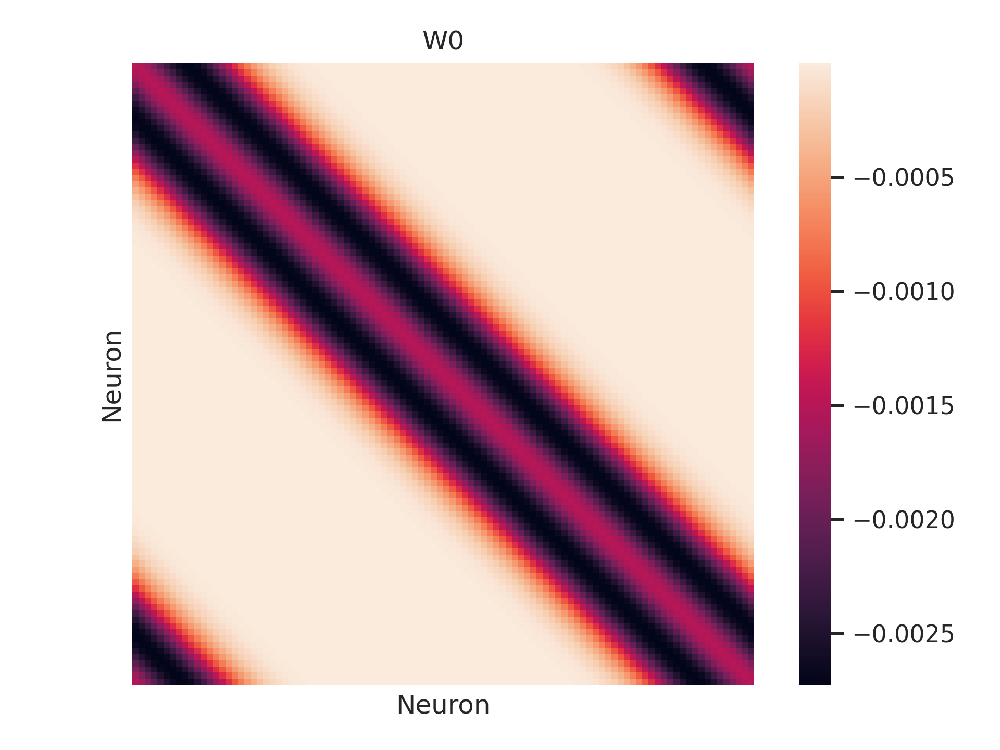
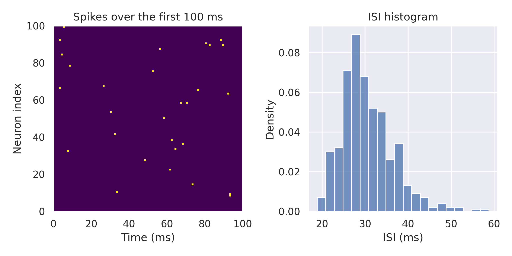
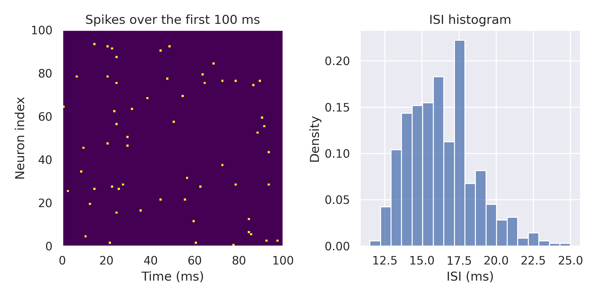

Parameter tuning
================
.. currentmodule:: spiking_network.models

In this tutorial we will show how to tune a model to a given firing rate. We will use the :class:`RectifiedLNP` model,
but the same procedure can be applied to any other differentiable model. 

The RectifiedLNP model is taken from the paper 
`"Systematic errors in connectivity inferred from activity in strongly coupled recurrent circuits" <https://www.biorxiv.org/content/10.1101/512053v1.full>`_. 
In the paper it is hand-tuned to get an interspike interval of 16 ms (62.5 Hz firing rate). We will show how to do this automatically using :mod:`spykeometric`.

The tuning procedure is as follows:
    #. Generate a dataset of networks with some connectivity you are interested in
    #. Select a model and initialize its parameters to some initial values
    #. Use the `tune` function to find the parameters that minimize the squared difference between the model's firing rate and the target firing rate

If you want to fit the parameters to some other target, you can use the model as any other PyTorch module and 
write your own training loop. The :meth:`tune` method is just a convenience function that does this for you.
Note only that you will want to call the :meth:`set_tunable` method at some point before training
to make sure gradients are computed for the parameters you want to tune, since this is not the default behavior.

Preparing the training data
---------------------------
We start by generating some networks that we want to fit the model on. We will use 24 networks of 100 neurons each, 
with the neurons organized in a ring network with inhibitory weights drawn from a mexican hat distribution.

.. code-block:: python

    # Create a dataset of random connectivity matrices to train on
    n_neurons = 100
    n_networks = 24
    dataset = MexicanHatGenerator(100, a=1.0015, sigma_1=6.98, sigma_2=7.).generate_examples(n_networks)
    data_loader = DataLoader(dataset, batch_size=5, shuffle=True)

The networks look like this:

Note that in this case the networks are not random, and all the networks have the same connectivity.
It is still useful to use a dataset with several copies, since it allows us to use the :class:`DataLoader` to iterate over the networks
in batches. We will use 5 networks per batch to speed up the training and data generation.

The Rectified Linear-Nonlinear-Poisson model
---------------------------------------------
In the :class:`RectifiedLNP` model, neurons are subject to a uniform background input :math:`b` in addition to the recurrent synaptic input from neighbors,
weighted by :math:`r`. Spikes from neighboring neurons are filtered by an exponential decay with a time constant :math:`\tau`.
For each time step, spikes are sampled from a Poisson distribution after passing the input through a thresholded scaled rectifier.

.. math::

    g_i(t+1) &= \sum_{j \in \mathcal{N}(i)} \mathbf{W}_{j, i} \cdot \mathbf{x}_j(t) + b \\
    \mu_i(t+1) &= \lambda_0 [g_i(t+1) - \theta]_+ \\
    x_i(t+1) &\sim \text{Pois}(\mu_i(t+1))

We choose the same parameters as in the paper, except for the threshold :math:`\theta`, which is not specified in the paper and which we will tune.

.. code-block:: python

    model = RectifiedLNP(
        lambda_0=100.,          # Scales the output of the rectifier
        theta=1e-4,             # Threshold of the rectifier
        T=20,                   # Length of the time window for the exponential filter (ms)
        tau=10.,                # Time constant of the exponential filter (1/ms)
        dt=0.1,                 # Time step (ms)
        r=0.0025,               # Recurrent weight
        b=0.001                 # Background input  
    )

Let's run the model on the test set and see what the firing rates look like:

.. code-block:: python

    results = torch.zeros((n_neurons*len(test)), 10000)
    for i, data in enumerate(test_loader):
        results[i*data.num_nodes:(i+1)*data.num_nodes] = model.simulate(data, n_steps=10000)

    # Average firing rate:  33.88600051403046 Hz
    # Average ISI:  29.510713577270508 ms

We get a firing rate of about 34 Hz and an interspike interval of about 29 ms. The plots show
the spikes over the first 100 ms for the first network and the ISI histogram for all the test networks.

This is not quite the target firing rate of 62.5 Hz. Let's see if we can improve it by 
tuning the threshold parameter :math:`\theta`.

Tuning the model
----------------
We will use the built in :meth:`tune` method to find the a threshold parameter :math:`\theta` that works.
The `tune` method takes a dataset, a target firing rate, and a set of parameter names to tune. 
The :code:`tunable_parameters` defaults to all parameters, but you can specify a subset of parameters to tune by passing a list of strings,
each of which is the name of a parameter to tune. If you have a stimulus attached to the model, you can also pass
:code:`"stimulus"` to tune the stimulus parameters or :code:`"model"` to tune the only the model parameters.
It also takes optional arguments :code:`n_steps`, :code:`lr` and :code:`n_epochs` to specify the number 
of steps to run the simulation for each epoch, the learning rate and the number of epochs to run the optimization for.

.. code-block:: python

    for data in train_loader:
        model.tune(data, firing_rate=62.5, tunable_parameters=["theta"], n_steps=10, lr=1e-6, n_epochs=100)

After the tuning procedure, the model has been updated with a new value for :math:`\theta`. Let's see how the firing rate changed:

.. code-block:: python

    results = torch.zeros((n_neurons*len(test)), 10000)
    for i, data in enumerate(test_loader):
        results[i*data.num_nodes:(i+1)*data.num_nodes] = model.simulate(data, n_steps=10000)

    # New firing rate:  62.26800009608269 Hz
    # New ISI:  16.059614181518555 ms

We now get firing rate 62.26 Hz and an interspike interval of 16.05 ms, which is much closer to the target.

That concludes this tutorial. We hope you found it useful. If you want to learn how you can also tune
the parameters of a stimulus, check out the :doc:`Working with stimuli <stimuli>` tutorial. The tutorial is also available as a juptyer
notebook in the `examples` folder of the repository.

